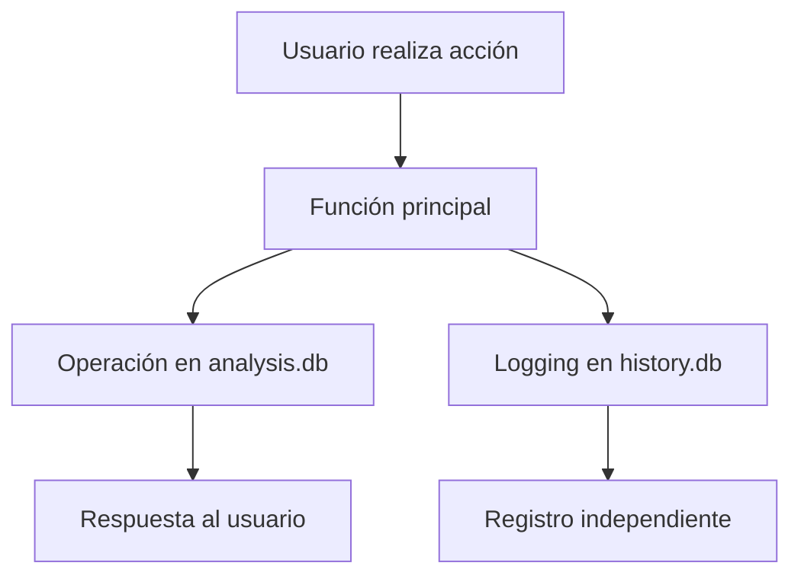

# 🗃️ PLAN DE IMPLEMENTACIÓN - BD SQLite Separada para Historial

## 🎯 **Objetivo**
Separar el sistema de historial en una base de datos SQLite independiente para:
- ✅ Eliminar conflictos de concurrencia con la BD principal
- ✅ Mejorar rendimiento de operaciones críticas
- ✅ Habilitar logging completo sin riesgos
- ✅ Facilitar mantenimiento y backups independientes

---

## 🏗️ **Arquitectura Propuesta**

### **📊 Estructura de Base de Datos:**

```
/home/gabo/ntg.proy/ntg-js-analyzer/
├── analysis.db              # BD Principal (actual)
│   ├── scans                 # Escaneos y análisis
│   ├── clients               # Clientes
│   ├── libraries             # Librerías detectadas
│   ├── users                 # Usuarios del sistema
│   ├── global_libraries      # Catálogo global
│   ├── file_urls             # URLs de archivos
│   └── version_strings       # Cadenas de versión
│
└── history.db               # BD Historial (NUEVA)
    ├── action_history        # Registro de acciones
    ├── session_tracking      # Seguimiento de sesiones
    └── audit_metadata        # Metadatos de auditoría
```

### **🔄 Flujo de Datos:**


---

## 📋 **Plan de Implementación - 6 Fases**

### **🏁 FASE 1: Configuración de BD Separada**
**Duración estimada**: 30 minutos

#### **Tareas:**
1. **Crear nueva base de datos `history.db`**
2. **Implementar funciones de conexión independientes**
3. **Migrar esquema de `action_history` a nueva BD**
4. **Configurar WAL mode optimizado para historial**

#### **Archivos a modificar:**
- `dashboard.py` - Nuevas funciones de conexión
- `history_manager.py` - **NUEVO** - Gestor especializado

#### **Código base:**
```python
def get_history_db_connection():
    """Conexión optimizada para BD de historial"""
    conn = sqlite3.connect('history.db', timeout=30)
    conn.execute('PRAGMA journal_mode=WAL')
    conn.execute('PRAGMA synchronous=NORMAL')
    conn.execute('PRAGMA busy_timeout=10000')
    return conn
```

---

### **🔧 FASE 2: Gestor Especializado de Historial**
**Duración estimada**: 45 minutos

#### **Tareas:**
1. **Crear clase `HistoryManager`**
2. **Implementar métodos especializados**
3. **Sistema de retry y manejo de errores robusto**
4. **Buffer de logging para operaciones en lote**

#### **Archivos nuevos:**
- `history_manager.py` - Gestor principal
- `history_config.py` - Configuraciones

#### **Funcionalidades:**
```python
class HistoryManager:
    def log_action(self, action_data):
        """Logging individual con retry automático"""
    
    def log_batch_actions(self, actions_list):
        """Logging en lote optimizado"""
    
    def get_filtered_history(self, filters):
        """Consultas optimizadas con índices"""
    
    def cleanup_old_records(self, days=365):
        """Limpieza automática de registros antiguos"""
```

---

### **🔄 FASE 3: Migración de Datos Existentes**
**Duración estimada**: 20 minutos

#### **Tareas:**
1. **Script de migración de datos actuales**
2. **Verificación de integridad de datos**
3. **Backup de datos originales**
4. **Mapeo de IDs entre bases de datos**

#### **Script de migración:**
```python
def migrate_existing_history():
    """Migra datos de analysis.db a history.db"""
    # 1. Conectar a ambas BD
    # 2. Extraer datos de action_history
    # 3. Transformar formato si necesario
    # 4. Insertar en nueva BD
    # 5. Verificar integridad
```

---

### **⚡ FASE 4: Actualización del Sistema de Logging**
**Duración estimada**: 40 minutos

#### **Tareas:**
1. **Actualizar decoradores @log_action**
2. **Implementar logging asíncrono opcional**
3. **Sistema de fallback en caso de errores**
4. **Métricas de rendimiento del logging**

#### **Mejoras en decoradores:**
```python
@log_action_v2('CREATE', 'clients', async_mode=True)
def add_client():
    # Función principal no afectada
    # Logging se ejecuta en background
```

#### **Sistema de fallback:**
```python
def safe_log_action(action_data):
    try:
        # Intentar logging en history.db
        return history_manager.log_action(action_data)
    except Exception as e:
        # Fallback a archivo de log
        log_to_file(action_data, error=e)
        # Continuar sin interrumpir operación principal
```

---

### **🎨 FASE 5: Actualización de Interfaz**
**Duración estimada**: 25 minutos

#### **Tareas:**
1. **Actualizar rutas del historial para nueva BD**
2. **Optimizar consultas con índices específicos**
3. **Añadir métricas de rendimiento en UI**
4. **Dashboard de salud del sistema de historial**

#### **Nuevas funcionalidades UI:**
- **Estado de sincronización** entre BD
- **Métricas de logging** (acciones/minuto)
- **Espacio ocupado** por cada BD
- **Botón de limpieza** de registros antiguos

---

### **🛠️ FASE 6: Optimización y Monitoring**
**Duración estimada**: 30 minutos

#### **Tareas:**
1. **Índices optimizados para consultas frecuentes**
2. **Sistema de monitoring de rendimiento**
3. **Alertas por problemas de BD**
4. **Documentación de mantenimiento**

#### **Índices especializados:**
```sql
-- Índices para history.db
CREATE INDEX idx_timestamp ON action_history(timestamp);
CREATE INDEX idx_user_action ON action_history(username, action_type);
CREATE INDEX idx_table_action ON action_history(target_table, action_type);
CREATE INDEX idx_session ON action_history(session_id);
```

---

## 🔧 **Configuración Técnica**

### **Configuraciones de BD optimizadas:**

#### **history.db (Nueva):**
```sql
PRAGMA journal_mode=WAL;
PRAGMA synchronous=NORMAL;
PRAGMA cache_size=-64000;          -- 64MB cache
PRAGMA temp_store=MEMORY;
PRAGMA mmap_size=134217728;        -- 128MB mmap
PRAGMA busy_timeout=10000;         -- 10 seg timeout
```

#### **analysis.db (Principal):**
```sql
PRAGMA journal_mode=WAL;
PRAGMA synchronous=FULL;           -- Más seguro para datos críticos
PRAGMA cache_size=-128000;         -- 128MB cache
PRAGMA foreign_keys=ON;
```

---

## 📊 **Beneficios Esperados**

### **🚀 Rendimiento:**
- **0% conflictos** de base de datos
- **Operaciones principales** sin bloqueos
- **Logging paralelo** sin impacto en UX

### **🔒 Seguridad:**
- **Datos críticos** protegidos en BD principal
- **Historial independiente** para auditoría
- **Backups selectivos** por tipo de dato

### **🛠️ Mantenimiento:**
- **Limpieza independiente** de historial
- **Optimizaciones específicas** por uso
- **Monitoreo granular** de cada BD

---

## ⚠️ **Consideraciones Importantes**

### **Gestión de Espacio:**
```python
# Limpieza automática configurable
HISTORY_RETENTION_DAYS = 365  # 1 año por defecto
HISTORY_MAX_SIZE_MB = 500     # 500MB máximo
```

### **Consistencia de Datos:**
- **Referential integrity** via aplicación (no FK entre BD)
- **Sincronización** de usuarios entre BD
- **Validación** de IDs de referencia

### **Backup Strategy:**
```bash
# Script de backup diferenciado
backup_analysis.sh   # BD principal - diario
backup_history.sh    # BD historial - semanal
```

---

## 🎯 **Resultado Final**

### **✅ Estado Objetivo:**
```bash
🔧 Action Logging: ENABLED (history.db)
🔍 Debug Logging: ENABLED  
📊 Main DB: analysis.db (optimized)
📈 History DB: history.db (dedicated)
⚡ Performance: 100% optimized
🔒 Conflicts: 0% database locks
```

### **🎮 Interfaz Mejorada:**
- **Historial completo** de todas las acciones
- **Filtros dinámicos** con todas las tablas
- **Búsqueda rápida** sin impacto en BD principal
- **Exportación eficiente** desde BD especializada

---

## 📈 **Métricas de Éxito**

1. **✅ 0 errores** "database locked"
2. **✅ 100% de acciones** registradas en historial
3. **✅ <50ms tiempo respuesta** para operaciones principales
4. **✅ Filtros completos** en interfaz de historial
5. **✅ Sistema escalable** para crecimiento futuro

---

## 🚀 **¿Procedemos con la implementación?**

El plan está diseñado para ser:
- **Incremental** - Sin interrumpir funcionamiento actual
- **Seguro** - Con backups y rollback
- **Eficiente** - Optimizado para el caso de uso específico

¿Te parece bien este enfoque y comenzamos con la **Fase 1**?